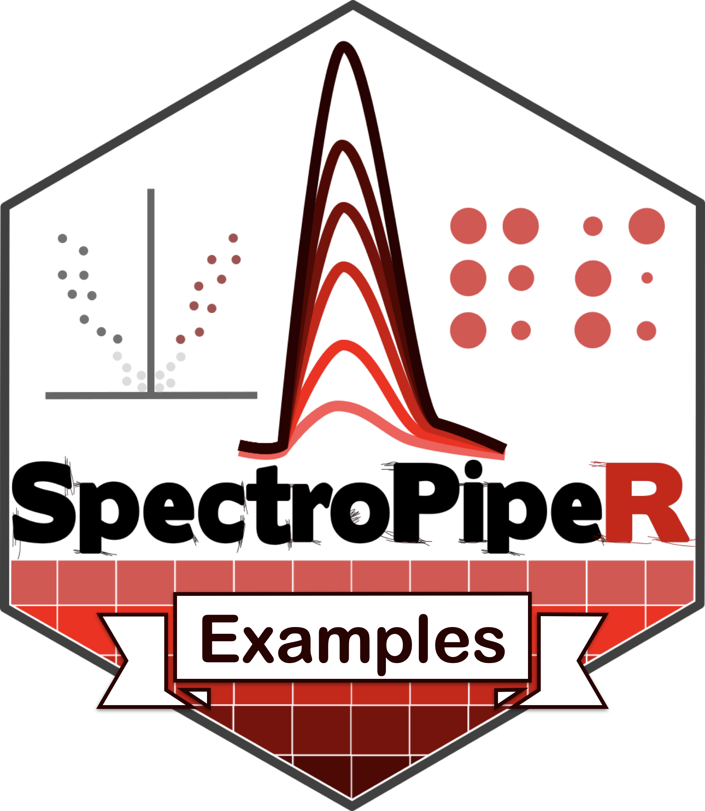
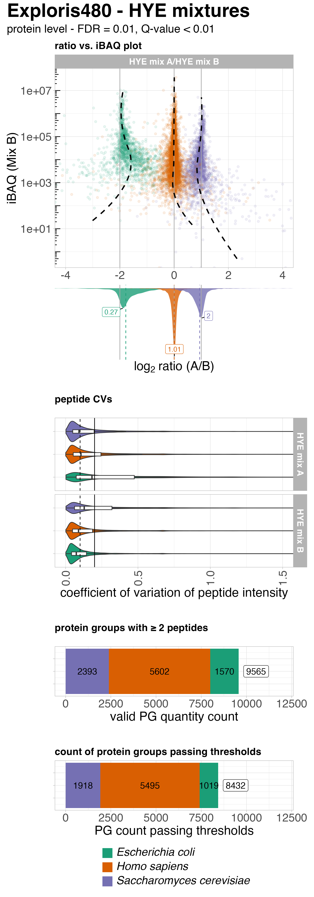
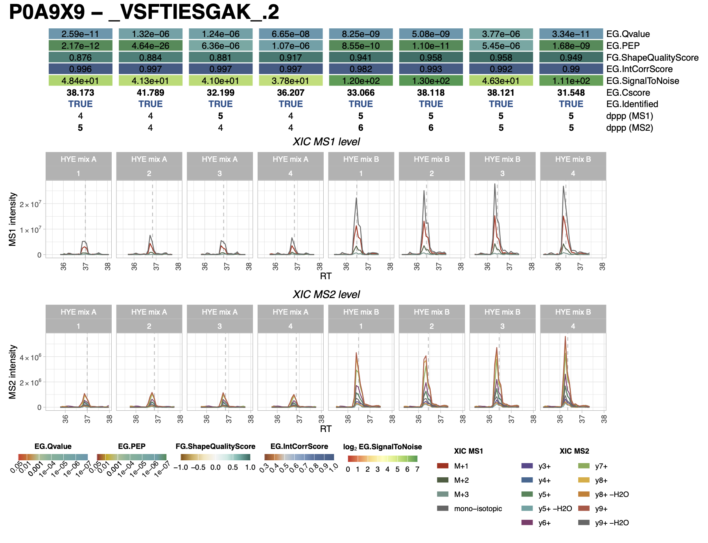
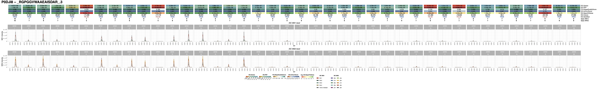

# SpectroPipeR example outputs 

The manual can be found under https://stemicha.github.io/SpectroPipeR/

<!-- badges: start -->
<!-- badges: end -->

## Example 1

In the realm of mass spectrometry, species mix experiments have become a standard procedure, routinely employed in facilities worldwide. These experiments are used to benchmark the performance of various methods and devices. For the analysis we used the Exploris480 data from Reder et al., 2023.

The data can be obtained from: https://massive.ucsd.edu/ProteoSAFe/dataset.jsp?task=0f33717d84fd45b1a318ad40670022cc

Reder, A. et al. MassSpecPreppy—An end‐to‐end solution for automated protein concentration determination and flexible sample digestion for proteomics applications. PROTEOMICS (2023) doi:10.1002/pmic.202300294.
  

The analysis with SpectroPipeR was performed using default parameters.

<u>analysis script:</u> `species_mix_analysis.R`

<u>analysis outputs can be found inside:</u> `species_mix_analysis` folder

<u>exemplary html report:</u> [species mix report](species_mix_analysis/2024_07_11__11_35_SpectroPipeR_report.html)

<u>additional species mix plot panel + script:</u> `species_mix_analysis.R`

{width="40%"}

#### exemplary protein canditdate XIC plot using SpectroPipeR

Choosen was the Cold shock protein CspA - P0A9X9 (FC: -4.248; q-value: 1.685e-07), which should exhibit an abs. fold-change of 4.

<u>The plots can be found under:</u> `species_mix_analysis/XIC_plots`

## Example 2

In the study from Vitko et al. 2024, plasma samples from 20 late-stage lung cancer patients and 20 control individuals
were analyzed using the timsTOF HT mass spectrometer. The samples were processed with the Proteograph
Product Suite, which employs five distinct nanoparticles (NP1−5) to compress the dynamic range of the
plasma proteome, enabling deeper proteome profiling. Specifically, the NP2 nanoparticle was used for enrichment of plasma. In this example the Evosep/timsTOF HT measurements of NP2 were used.

https://pubs.acs.org/doi/10.1021/acs.jproteome.3c00646

Vitko, D. et al. timsTOF HT Improves Protein Identification and Quantitative Reproducibility for Deep Unbiased Plasma Protein Biomarker Discovery. J. Proteome Res. (2024) doi:10.1021/acs.jproteome.3c00646.
  
### analysis

The analysis with SpectroPipeR was performed using default parameters.

<u>analysis script:</u> `SpectroPipeR_analysis_cancer_cohort.R`

<u>analysis outputs can be found inside:</u> `PXD047839_cancer_cohort_NP2_SEER_SN19` folder

<u>exemplary html report:</u> [PXD047839 - cancer cohort - NP2 - SEER](PXD047839_cancer_cohort_NP2_SEER_SN19/2024_07_11__11_35_SpectroPipeR_report.html)

#### exemplary protein canditdate XIC plot using SpectroPipeR

Choosen was the Serum amyloid A-1 protein (FC: 4.553; q-value: 2.597e-13) which was detected in higher abundance in the cancer cohort in comparison to the control cohort.

<u>The plots can be found under:</u> `PXD047839_cancer_cohort_NP2_SEER_SN19/XIC_plots`

